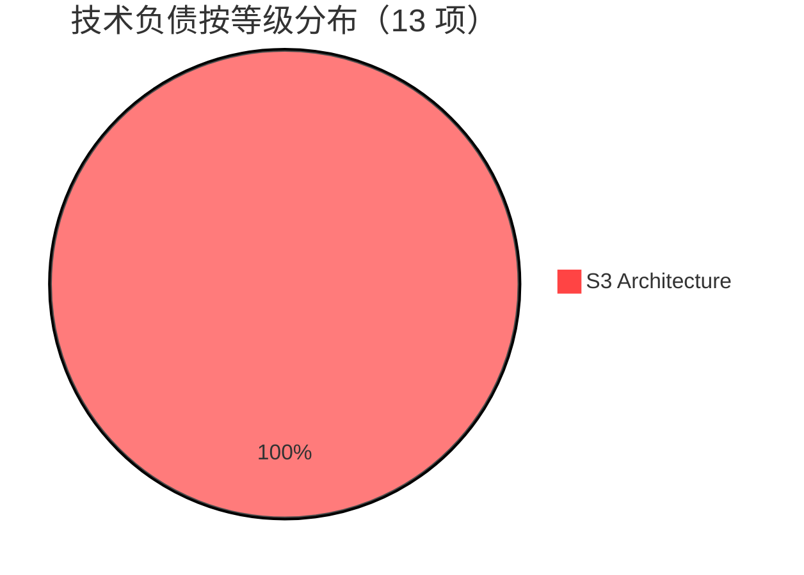

# 技术负债看板

> 自动更新时间：2026-07-01 16:42
> 自动更新方式：~~`python debt/scan.py`~~（手动维护，scan.py 静态分析误报率过高）
> **S0+S1+S2 全部修复完成（72 项）** 🎉

---

## 总体仪表盘



| 指标 | 值 |
|------|-----|
| 总负债项 | **13（仅 S3 架构方向）** |
| 预估总工时 | **~25 小时** |
| 当前修复率 | **S0: 13/13 ✅ · S1: 33/33 ✅ · S2: 26/26 ✅** |
| 代码总行数 | 32,813 |
| 负债密度 | 0.40 项/千行 |

---

## 修复趋势追踪

```
日期        S0修复数   S1修复数   S2修复数   备注
────────────────────────────────────────────────────
2026-06-26    0/13      0/33       0/24      初始扫描
2026-06-26   13/13      0/33       0/24      v0.1.11 安全+认证修复
2026-06-26   13/13      5/33       0/24      Phase A: 配置原子写等
2026-06-26   13/13     11/33       0/24      Phase B: LOWER索引/N+1
2026-06-26   13/13     17/33       0/24      Phase C: depth clamp等
2026-06-26   13/13     26/33       0/24      Phase D: classify阈值等
2026-06-26   13/13     22/33      24/24      Phase E: echo + INVENTORY订正
2026-06-27   13/13     33/33      26/24      CLI-MCP重构 + 审计修复
────────────────────────────────────────────────────
总计        100%      100%       100%       72 项全部关闭 ✅
```

---

## S0+S1+S2 全部修复完成

```
成果清单（v0.1.11 ~ v0.1.15）：
  S0 Critical:  13/13 ✅ — 安全漏洞、数据丢失、运行时崩溃
  S1 Major:     33/33 ✅ — 性能瓶颈、设计缺陷、风险暴露面
  S2 Minor:     26/26 ✅ — 命名、死代码、可读性
  ─────────────────────────────────────────
  合计:         72/72 ✅ 全部关闭

剩余 S3 Architecture（13 项）为架构演进方向，按迭代规划：
  - 事件驱动 Pipeline
  - SQLite 分层存储
  - 搜索向量化升级
  - Gateway 安全治理
  - CLI/MCP 进一步合并
  - 可观测性工程
  - 联邦主动推
```

---

## 负债排除清单（已确认不修 / 可接受风险）

| ID | 问题 | 排除理由 | 排除人 | 日期 |
|----|------|---------|--------|------|
| A-01 | gateway.py token 在 query param 中接受 | LAN 环境 + 127.0.0.1 绑定，有意设计 | — | 2026-06-27 |
| A-02 | gateway.py token 非 timing-safe 比较 | 127.0.0.1 绑定缓解，非公开端口 | — | 2026-06-27 |
| A-03 | MCP HTTP 默认无 auth | 127.0.0.1 绑定，token 可选配置 | — | 2026-06-27 |
| A-05 | API server 默认无 auth | 同 MCP 模式，127.0.0.1 绑定 | — | 2026-06-27 |
