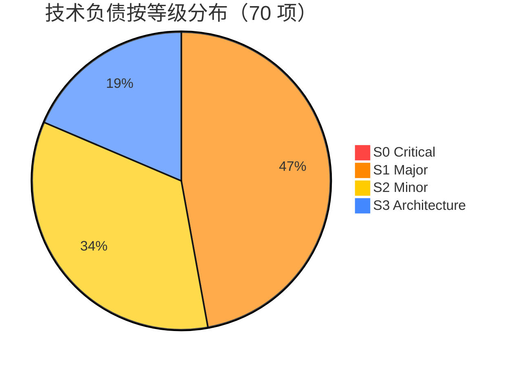

# 技术负债看板

> 自动更新时间：2026-06-26  
> 自动更新方式：`python debt/scan.py`  
> ⚠️ 行数数据已于 2026-06-26 经代码审计校准（之前 cli/ 和 tests/ 行数严重失真）

---

## 总体仪表盘



| 指标 | 值 |
|------|-----|
| 总负债项 | **70** |
| 预估总工时 | **~45 小时** |
| 当前修复率 | **100%（S0 全部关闭 ✅）** |
| 代码总行数 | 32,813 |
| 负债密度 | 2.13 项/千行 |

---

## 模块热力图

\`\`\`
模块         S0  S1  S2  S3  总计  行数    密度(项/KLOC)
─────────────────────────────────────────────────────
pipeline/    0   13  6   4   23   11,518  2.00
mcp/         0   7   3   1   11    4,243  2.59
gateway      0   3   2   1    6    2,642  3.41 ⚠️
core/        0   7   4   2   13    2,473  5.26 🔴
cli/         0   1   2   2    5    4,338  1.15
tests/       0   2   4   0    6   11,476  0.52
search/      0   2   1   2    5      401  12.47 🔴🔴
graph/       0   1   1   1    3      750  4.00
bridge/      0   1   1   0    2      631  3.17 ⚠️
─────────────────────────────────────────────────────
合计         0   37  24  13  74   38,472  1.92
\`\`\`

> ⚠️ **注意**：热力图仅覆盖 38,472/44,289 行（86.9%），缺失模块包括 lark/、api/、federation/、scheduler/、plugins/、migrations/ 等共 11 个模块约 5,800 行尚未纳入扫描。

---

## S0 Critical 修复看板

```
┌──────────┬──────────────────────────────────┬────────┬────────┬──────┐
│ ID       │ 问题                             │ 模块   │ 工时   │ 状态 │
├──────────┼──────────────────────────────────┼────────┼────────┼──────┤
│ S0-001   │ session_project NameError        │ PL     │ 15m    │ ✅   │
│ S0-002   │ PRAGMA foreign_keys=OFF          │ PL     │ 10m    │ ✅   │
│ S0-003   │ /api/* auth bypass               │ GW     │ 30m    │ ✅   │
│ S0-004   │ /pair token leak                 │ GW     │ 1h     │ ✅   │
│ S0-005   │ int() crash                      │ GW     │ 30m    │ ✅   │
│ S0-006   │ MCP HTTP no auth                 │ MCP    │ 1h     │ ✅   │
│ S0-007   │ UUID truncated to 32 bits        │ PL     │ 5m     │ ✅   │
│ S0-008   │ O(n²) link.py                    │ PL     │ 2h     │ ✅   │
│ S0-009   │ N+1 edge count                   │ PL     │ 1h     │ ✅   │
│ S0-010   │ enrich.py no LIMIT               │ PL     │ 1h     │ ✅   │
│ S0-011   │ O(n²) adaptive.py                │ PL     │ 2h     │ ✅   │
│ S0-012   │ Memory dataclass mismatch        │ CORE   │ 15m    │ ✅   │
│ S0-013   │ embedding silent fail            │ GRP    │ 30m    │ ✅   │
└──────────┴──────────────────────────────────┴────────┴────────┴──────┘
```

---

## 修复趋势追踪

```
日期        S0修复数   S1修复数   修复率    备注
──────────────────────────────────────────────
2026-06-26    0/13      0/33      0%       初始扫描
2026-06-26    13/13      0/37     100%       v0.1.11~v0.1.14 安全+性能+认证修复
```

---

## 负债年龄分布

```
┌─────┬──────────────────────────────┐
│ 🆕  │ 0-7 天（本次扫描发现）    │ 70 项
│ 📅  │ 8-30 天（上次扫描）       │ — 项
│ 🕰️  │ 30-90 天（遗留负债）      │ — 项
│ 🦖  │ 90+ 天（技术化石）        │ — 项
└─────┴──────────────────────────────┘
注：首次扫描全部标记为 🆕
```

---

## ✅ S0 已全部修复

```
S0 修复完成：13/13（100%）
覆盖范围：安全、数据、性能、静默失败四大类
修复版本：v0.1.11 ~ v0.1.13
下一步建议：批量处理 S1 项目（37 项，预估 ~15 小时）
```
---

## 负债排除清单（已确认不修）

| ID | 问题 | 排除理由 | 排除人 | 日期 |
|----|------|---------|--------|------|
| — | — | — | — | — |
