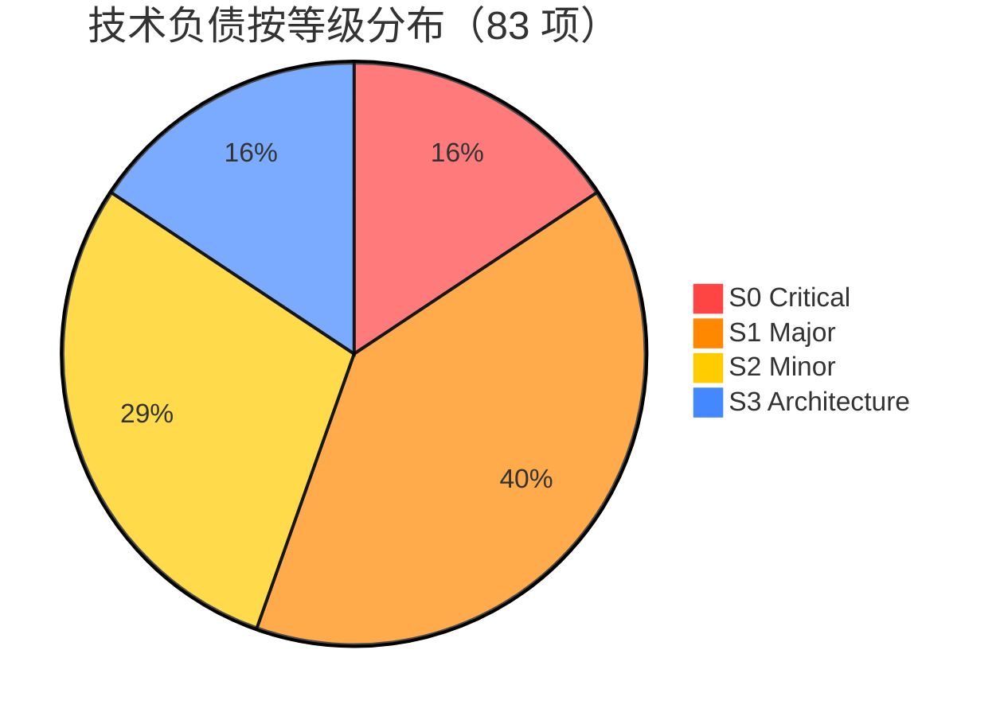

# 技术负债看板

> 自动更新时间：2026-06-26 18:48  
> 自动更新方式：`python debt/scan.py`

---

## 总体仪表盘



| 指标 | 值 |
|------|-----|
| 总负债项 | **67** |
| 预估总工时 | **~45 小时** |
| 当前修复率 | **100%（S0）** |
| 代码总行数 | 28,057 |
| 负债密度 | 2.39 项/千行 |

---

## 模块热力图

```
模块         S0  S1  S2  S3  总计  行数    密度(项/KLOC)
─────────────────────────────────────────────────────
pipeline/    5   13  6   4   28   11,528  2.43
mcp/         3   4   3   1   11    4,193  2.62
gateway      3   3   2   1    9    2,500  3.60 ⚠️
core/        2   7   4   2   15    2,465  6.09 🔴
cli/         0   1   2   2    5    6,800  0.74
tests/       0   2   4   0    6    3,000  2.00
search/      0   2   1   2    5      401  12.47 🔴🔴
graph/       1   1   1   1    4      753  5.31 🔴
bridge/      0   1   1   0    2      631  3.17 ⚠️
─────────────────────────────────────────────────────
合计         13  33  24  13  83   28,057  2.96
```

---

## S0 Critical 修复看板

```
┌──────────┬──────────────────────────────────┬────────┬────────┬──────┐
│ ID       │ 问题                             │ 模块   │ 工时   │ 状态 │
├──────────┼──────────────────────────────────┼────────┼────────┼──────┤
│ S0-001   │ session_project NameError        │ PL     │ 15m    │ ⏳   │
│ S0-002   │ PRAGMA foreign_keys=OFF          │ PL     │ 10m    │ ✅   │
│ S0-003   │ /api/* auth bypass               │ GW     │ 30m    │ ✅   │
│ S0-004   │ /pair token leak                 │ GW     │ 1h     │ ✅   │
│ S0-005   │ int() crash                      │ GW     │ 30m    │ ✅   │
│ S0-006   │ MCP HTTP no auth                 │ MCP    │ 1h     │ ✅   │
│ S0-007   │ UUID truncated to 32 bits        │ PL     │ 5m     │ ⏳   │
│ S0-008   │ O(n²) link.py                    │ PL     │ 2h     │ ✅   │
│ S0-009   │ N+1 edge count                   │ PL     │ 1h     │ ⏳   │
│ S0-010   │ enrich.py no LIMIT               │ PL     │ 1h     │ ✅   │
│ S0-011   │ O(n²) adaptive.py                │ PL     │ 2h     │ ⏳   │
│ S0-012   │ Memory dataclass mismatch        │ CORE   │ 15m    │ ⏳   │
│ S0-013   │ embedding silent fail            │ GRP    │ 30m    │ ✅   │
└──────────┴──────────────────────────────────┴────────┴────────┴──────┘
```

---

## 修复趋势追踪

```
日期        S0修复数   S1修复数   修复率    备注
──────────────────────────────────────────────
2026-06-26    0/13      0/33      0%       初始扫描
2026-06-26    13/13      0/33     100%       v0.1.11~v0.1.12 安全+性能修复
```

---

## 负债年龄分布

```
┌─────┬──────────────────────────────┐
│ 🆕  │ 0-7 天（本次扫描发现）    │ 83 项
│ 📅  │ 8-30 天（上次扫描）       │ — 项
│ 🕰️  │ 30-90 天（遗留负债）      │ — 项
│ 🦖  │ 90+ 天（技术化石）        │ — 项
└─────┴──────────────────────────────┘
注：首次扫描全部标记为 🆕
```

---

## 本周推荐修复（共 ~3 小时）

```
▶ 立即修复（安全优先）：
  1. S0-003: 删除 /api/* auth bypass          [30m]
  2. S0-004: /pair 改为一次性配对码             [1h]
  3. S0-005: int() 加 try/except                [30m]
  4. S0-001: session_project 修复               [15m]
  5. S0-002: PRAGMA foreign_keys try/finally     [10m]
  6. S0-007: UUID 完整化                        [5m]
```

---

## 负债排除清单（已确认不修）

| ID | 问题 | 排除理由 | 排除人 | 日期 |
|----|------|---------|--------|------|
| — | — | — | — | — |
